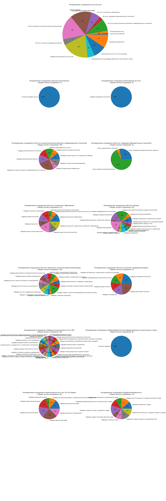

# kpfu_parser

как развернуть проект у себя в среде:
1. вызовите в terminal `pip install -r requirements.txt`
2. установите в `constants.py` в переменной `gecko_path` путь к вашему `gecko_driver.exe`

результат работы:

